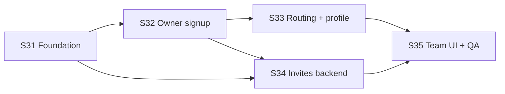

# MFMS Phase 1 — Identity & Tenancy Onboarding

**Marble Factory Management System (MFMS)**  
**Document version:** 1.0  
**Date:** July 2026  
**Status:** Sprint plan (pre-implementation)  
**Depends on:** v1.0 complete (Sprints S1–S24)

---

## 1. Purpose

Phase 1 delivers **self-service factory onboarding** so a marble factory can deploy MFMS **without Firebase Console** or manual Firestore edits.

When Phase 1 is complete:

1. A **new owner** can register, create a factory, and land in the app as `owner`.
2. The **owner** can **invite team members** (email + role) from the Team screen.
3. **Invited staff** can accept, set a password, and join the correct factory with the correct role.
4. The **owner** can edit the **factory profile** (name, address, phone) used on PDFs and exports.
5. The **owner** can **disable** a team member without deleting history.
6. **Onboarding routing** sends each user to the correct home screen (no more `factoryId: 'default'` trap).

**Out of scope for Phase 1:** multi-factory switching, co-owner governance, email verification, OAuth, audit log, QC photos (see v1.1 Sprint S30 remainder).

**Reference:** Prior analysis in chat; overlaps v1.1 roadmap items **30.1–30.3** — this document replaces those items with a full phased breakdown.

---

## 2. Current gaps (baseline)

| Gap | Impact |
|-----|--------|
| No signup UI | Users must exist in Firebase Auth before login |
| Auto-profile uses `factoryId: 'default'`, `role: viewer` | New users land in orphan tenant |
| Team screen only lists same-factory users | Cannot onboard staff from app |
| `FactoryRepository` read-only | No factory creation or settings UI |
| Firestore rules: factory create requires `isOwner() && factoryId == myFactory()` | Chicken-and-egg for new owners |
| Splash hardcodes `/dashboard` | Drivers/viewers hit wrong route |

---

## 3. Phase 1 exit criteria

| # | Criterion | Verified by |
|---|-----------|-------------|
| E1 | Brand-new email can **sign up** and create a factory in one flow | Manual test on clean Firebase project |
| E2 | New owner has `role: owner`, real `factoryId`, and `factories/{id}` doc exists | Firestore console |
| E3 | Owner invites `sales@example.com` as Sales Staff; invitee signs up and sees factory data | End-to-end invite test |
| E4 | Owner edits factory name; job work invoice PDF shows updated name | PDF export test |
| E5 | Owner disables a user; disabled user cannot access app data | Login + rules test |
| E6 | No new user profiles created with `factoryId: 'default'` | Auth repository + test account |
| E7 | Splash / router sends driver to deliveries, viewer to allowed home | Role routing test |
| E8 | Existing production factory migrated off `'default'` (documented procedure) | Migration checklist |

---

## 4. Architecture decisions (locked for Phase 1)

| Decision | Choice | Rationale |
|----------|--------|-----------|
| Factory bootstrap | **Firebase Callable Cloud Functions** | Client cannot create factory under current rules |
| Invite accept | **Callable Function** sets `users.factoryId` + `role` | Client must not assign arbitrary tenancy |
| Tenancy model | **Single `factoryId` per user** (unchanged) | No multi-factory refactor in Phase 1 |
| User disable | **`status: active \| disabled`** on `users` doc | Preserve history; block in rules |
| Invite storage | **`invites` collection** | Owner can list/revoke pending invites |
| Deprecate `'default'` | Stop auto-assign; use onboarding gate | Eliminates orphan tenants |

---

## 5. Target data model (Phase 1)

### `users/{uid}` (extended)

```
email, name, role, factoryId, createdAt, photoUrl?, employeeId?
status: active | disabled          // NEW — default active
onboardingComplete: bool           // NEW — optional; or derive factoryId != ''
```

### `factories/{factoryId}` (extended)

```
name, address?, phone?, ownerName?
ownerUserId: string                // NEW — uid of creating owner
createdAt, updatedAt               // NEW
status: active                     // NEW
```

### `invites/{inviteId}` (NEW)

```
email: string
factoryId: string
role: string
invitedBy: string                  // owner uid
status: pending | accepted | expired | revoked
createdAt, expiresAt
acceptedAt?, acceptedBy?
```

### Cloud Functions (NEW)

| Function | Caller | Purpose |
|----------|--------|---------|
| `createFactoryAndOwner` | Unauthenticated or newly signed-up | Atomic factory + owner profile |
| `sendTeamInvite` | Owner | Create invite + send email |
| `acceptTeamInvite` | Authenticated invitee | Bind user to factory + role |
| `revokeTeamInvite` | Owner | Cancel pending invite |

---

## 6. Sprint overview

| Sprint | Focus | Duration (guide) | Depends on |
|--------|--------|------------------|------------|
| **S31** | Backend foundation & data model | 1 week | — |
| **S32** | Owner registration & factory creation | 1 week | S31 |
| **S33** | Onboarding routing & factory profile | 1 week | S32 |
| **S34** | Team invites (backend + accept flow) | 1 week | S31, S32 |
| **S35** | Team UI, disable user, migration & QA | 1 week | S33, S34 |

**Total estimate:** ~5 weeks (adjust for team size and Cloud Functions familiarity).



---

## 7. Sprint S31 — Backend foundation & data model

**Goal:** Cloud Functions project, schemas, and security design ready for Flutter integration.

### Tasks

| # | Task | Description | Acceptance criteria |
|---|------|-------------|---------------------|
| 31.1 | Functions project scaffold | `functions/` with TypeScript, Firebase Admin, emulators config | `firebase deploy --only functions` succeeds (stub functions) |
| 31.2 | Entity & model updates | Extend `FactoryProfile`, `AppUser`; add `Invite` entity + Firestore models | Dart models compile; `fromFirestore` backward compatible |
| 31.3 | `InviteRepository` (client read) | List pending invites for factory (owner); read own invite by token id | Repository unit-tested or manual emulator test |
| 31.4 | Rules design — `invites` | Owner read/write own factory invites; no client create without Function | Rules emulator tests pass |
| 31.5 | Rules design — `users.status` | Disabled users denied read/write on factory collections | Emulator test: disabled user blocked |
| 31.6 | Rules design — `factories` bootstrap | Document that factory create goes via Function only (no client loosening yet) | Security doc section in this file §4 |
| 31.7 | Deprecation plan | Document migration from `factoryId: 'default'` for existing deployments | Checklist in §12 of this doc |
| 31.8 | App strings & routes scaffold | `RoutePaths.signUp`, `acceptInvite`, `onboarding`, `factorySettings` | Paths compile; placeholder screens optional |

### Deliverables

- `functions/` directory in repo  
- Updated `firestore.rules` (invite + disabled user rules)  
- Dart domain models for invite + extended user/factory  
- Migration checklist draft  

### Exit

Backend contracts defined; Flutter can integrate against stub Callables in emulator.

---

## 8. Sprint S32 — Owner registration & factory creation

**Goal:** A new user can register and become factory owner without Console.

### Tasks

| # | Task | Description | Acceptance criteria |
|---|------|-------------|---------------------|
| 32.1 | `createFactoryAndOwner` Function | Input: email, password, name, factoryName, optional phone/address. Creates Auth user, `factories/{id}`, `users/{uid}` with `role: owner` | Single callable; idempotent on retry; returns factoryId |
| 32.2 | `AuthRepository.signUp` | Call Function or Auth create + Function for Firestore (prefer single Function) | Sign up returns `AppUser` with owner role |
| 32.3 | `AuthBloc` signup events | `AuthSignUpRequested` → loading/success/failure | BLoC tests for success + email-already-in-use |
| 32.4 | Sign up screen UI | Name, email, password, confirm password, factory name, optional factory phone | Validation; link to login |
| 32.5 | Login screen link | "Create factory account" → sign up | Navigation works |
| 32.6 | Remove auto `'default'` bootstrap | `_ensureUserProfile` no longer writes `factoryId: 'default'` for incomplete onboarding | New incomplete users flagged for onboarding route (S33) |
| 32.7 | Error handling | Map Firebase errors to `AppStrings` (email in use, weak password) | User-friendly snackbars |

### Deliverables

- Sign up screen + auth flow  
- Deployed `createFactoryAndOwner`  
- Updated `auth_repository.dart`  

### Exit

Fresh email → sign up → owner logged in with real `factoryId` (routing polish in S33).

---

## 9. Sprint S33 — Onboarding routing & factory profile

**Goal:** Correct navigation for all auth states; owner can edit factory details.

### Tasks

| # | Task | Description | Acceptance criteria |
|---|------|-------------|---------------------|
| 33.1 | Onboarding gate in router | Authenticated + no valid factory → `/onboarding` or block with message | No access to operational modules without factory |
| 33.2 | Fix splash routing | Use `PermissionRouteGuard.homeLocationFor(user)` instead of hardcoded dashboard | Driver lands on deliveries |
| 33.3 | `FactoryRepository` write | `createFactory`, `updateFactory` (owner client update after bootstrap) | Owner can update name/address/phone |
| 33.4 | Factory settings screen | More → Administration → Factory Profile (or Settings) | Form saves to Firestore |
| 33.5 | `FactoryProfileBloc` or extend settings | Load/watch factory doc; save with validation | Real-time name on screen |
| 33.6 | PDF/export integration | `FactoryDisplayService` invalidates cache on profile update | Invoice PDF shows new factory name |
| 33.7 | More menu entry | Factory Profile visible to owner (and factory manager read-only optional) | Route guarded by permission |
| 33.8 | Firestore rules — factory update | Owner can update own factory doc fields | Emulator test |

### Deliverables

- Factory settings screen  
- Router + splash fixes  
- Writable `FactoryRepository`  

### Exit

Owner edits factory name → PDF reflects change; all roles get correct home route.

---

## 10. Sprint S34 — Team invites (backend + accept flow)

**Goal:** Owner can invite by email; invitee can join factory with assigned role.

### Tasks

| # | Task | Description | Acceptance criteria |
|---|------|-------------|---------------------|
| 34.1 | `sendTeamInvite` Function | Owner only; validates email, role ≠ owner (or owner with confirm flag); creates `invites` doc | Pending invite in Firestore |
| 34.2 | Email delivery | Password-reset link, custom email template, or magic link with invite id | Invitee receives actionable email (or documented manual fallback for MVP) |
| 34.3 | `acceptTeamInvite` Function | Validates invite pending + email matches Auth user; sets `users` factoryId + role; marks invite accepted | User appears in team list |
| 34.4 | `revokeTeamInvite` Function | Owner cancels pending invite | Status → revoked |
| 34.5 | Accept invite screen | Route `/invite/accept?id=...` — sign up or login then accept | Deep link / query param works |
| 34.6 | `AuthBloc` accept flow | After login/signup on accept screen, call accept Function | Role and factory applied |
| 34.7 | Invite expiry | `expiresAt` default 7 days; expired invites rejected | Emulator / unit test |
| 34.8 | Duplicate invite handling | Re-invite same email refreshes or rejects cleanly | No duplicate active invites |

### Deliverables

- Three Callables deployed  
- Accept invite screen + route  
- `invites` collection live  

### Exit

Owner invites sales staff → invitee completes flow → sees customers/job work for that factory.

---

## 11. Sprint S35 — Team UI, disable user, migration & QA

**Goal:** Complete team management UX; production-ready hardening and migration.

### Tasks

| # | Task | Description | Acceptance criteria |
|---|------|-------------|---------------------|
| 35.1 | Team screen — Invite button | Sheet: email + role dropdown (exclude owner or confirm dialog) | Owner sends invite from app |
| 35.2 | Pending invites list | Show pending/revoked/expired; resend + revoke actions | Owner sees invite status |
| 35.3 | Disable user | Owner sets `status: disabled` on team member | User blocked by rules on next request |
| 35.4 | Enable user | Owner re-enables disabled member | Restores access |
| 35.5 | Owner safeguards | Cannot change own role; confirm before promoting another to owner | UI + optional rule |
| 35.6 | Team subtitle & empty states | Copy reflects invite flow, not "signed-in users only" | `app_strings.dart` updated |
| 35.7 | `UserRepository` updates | `disableUser`, `enableUser`, `watchTeamMembers` stream | Team list updates in real time |
| 35.8 | Migration procedure | Script or manual steps: move users off `'default'`, create `factories` doc | §12 checklist executed on staging |
| 35.9 | Integration test plan | Matrix: owner signup, invite accept, disable, factory edit, role homes | Test doc or automated tests |
| 35.10 | Update v1.1 roadmap | Mark 30.1–30.3 delivered via Phase 1; link this doc | `MFMS_v1.1_Roadmap.md` cross-ref |

### Deliverables

- Enhanced Team screen  
- Disable/enable user  
- Migration runbook  
- QA sign-off  

### Exit

**Phase 1 complete** — all §3 exit criteria met.

---

## 12. Migration checklist (existing deployments)

Use before or during S35 on production/staging.

1. Create `factories/{productionFactoryId}` with correct name, `ownerUserId`, timestamps.  
2. For each user in Firebase Auth, ensure `users/{uid}` exists with:
   - `factoryId` = production factory id (not `'default'`)  
   - `role` = correct role (owner for primary owner)  
   - `status` = `active`  
3. Query operational collections for `factoryId == 'default'`; reassign or delete orphans.  
4. Deploy updated `auth_repository` (no new `'default'` profiles).  
5. Deploy Cloud Functions.  
6. Owner verifies Team list, sends test invite to personal email.  
7. Verify Firestore rules with disabled test user.

---

## 13. File impact map (guide)

| Area | Expected new/updated files |
|------|----------------------------|
| Cloud Functions | `functions/src/createFactoryAndOwner.ts`, `sendTeamInvite.ts`, `acceptTeamInvite.ts`, `revokeTeamInvite.ts` |
| Auth | `sign_up_screen.dart`, `auth_repository.dart`, `auth_bloc.dart`, `auth_event.dart`, `auth_state.dart` |
| Onboarding | `accept_invite_screen.dart`, `onboarding_screen.dart` (if needed) |
| Factory | `factory_settings_screen.dart`, `factory_repository.dart`, `factory_profile_bloc.dart` |
| Team | `team_screen.dart`, `invite_member_sheet.dart`, `pending_invites_section.dart`, `user_repository.dart`, `team_bloc.dart` |
| Routing | `app_router.dart`, `route_paths.dart`, `splash_screen.dart`, `permission_route_guard.dart` |
| Domain | `invite.dart`, `app_user.dart`, `factory_profile.dart`, `user_model.dart`, `factory_model.dart` |
| Security | `firestore.rules` |
| DI | `injection.dart` |
| Strings | `app_strings.dart` |

---

## 14. Risks & mitigations

| Risk | Mitigation |
|------|------------|
| Email delivery fails (no domain) | MVP: show temp password + copy link; add SendGrid later |
| Callable cold start latency | Show loading; region close to users (asia-south1) |
| Existing users on `'default'` | Migration checklist §12 before enabling signup |
| Owner promotes second owner | Confirm dialog; document co-owner policy |
| Rules drift vs `RolePermissions` | Emulator tests; single source of truth doc |

---

## 15. Relationship to v1.1 roadmap

| v1.1 item | Phase 1 sprint |
|-----------|----------------|
| 30.1 Invite user flow | S34, S35 |
| 30.2 Disable user | S35 |
| 30.3 Factory profile editor | S33 |
| 25.7 Onboarding doc | S35 (update with signup + invite steps) |

**Recommended execution order:** Run **Phase 1 (S31–S35) before** v1.1 S25–S30, so the factory can onboard staff before release hardening and FCM.

---

## 16. Definition of done (per sprint)

- [ ] Tasks in sprint table completed  
- [ ] `flutter analyze` clean  
- [ ] Firestore rules deployed to staging  
- [ ] Functions deployed to staging  
- [ ] Manual test notes recorded  
- [ ] No new `factoryId: 'default'` users in staging  

---

*Next step after approval: implement **Sprint S31** (Functions scaffold + data models + rules).*
